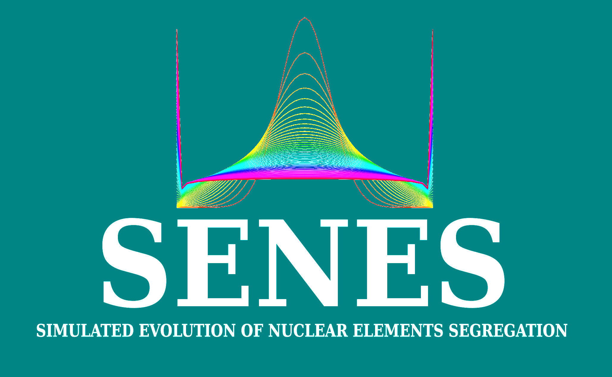

<br clear="left"/>

## SENES /sɪˈnɛs/
[](https://zenodo.org/badge/latestdoi/305942233)

> Simulated Evolution of Nuclear Elements Segregation

**``SENES``** simulates the random segregation of genetic elements across amitotic divisions in a population of polyploid cells. Amitosis is a spindle-independent nuclear division characteristic of polyploid nuclei, which is associated with the random or _quasi_-random segregation of genetic elements to daughter cells. This process, also known as _somatic assortment_, may lead to the generation of stable genetic and phenotypic variation in asexually dividing heterozygous cells. 

In combination with empirical data, **``SENES``** may improve our understanding of  the genetic consequences of somatic assortment in asexually reproducing cells and provide fresh insights into the macronuclear architecture of ciliates.

<!-- START doctoc generated TOC please keep comment here to allow auto update -->
<!-- DON'T EDIT THIS SECTION, INSTEAD RE-RUN doctoc TO UPDATE -->
**Table of Contents**  *generated with [DocToc](https://github.com/thlorenz/doctoc)*

- [What can I do with SENES?](#what-can-i-do-with-senes)
- [Installation](#installation)
  - [Install Python and its dependencies](#install-python-and-its-dependencies)
  - [Clone the repository](#clone-the-repository)
  - [Add _senes_ folder to $PATH](#add-senes-folder-to-path)
  - [Make senes.py executable](#make-senespy-executable)
- [Usage](#usage)
- [Output](#output)
  - [The following output is written at the specified directory ``-o dir/prefix``:](#the-following-output-is-written-at-the-specified-directory--o-dirprefix)
- [Example Run](#example-run)
  - [Haploid model](#haploid-model)
  - [Chromosomal model](#chromosomal-model)
- [Contributing](#contributing)
- [Contacts](#contacts)
- [Acknowledgements](#acknowledgements)
- [License](#license)
- [Literature](#literature)

<!-- END doctoc generated TOC please keep comment here to allow auto update -->

## What can I do with SENES?

**``SENES``** can predict the copy number distribution of an allele in a population of amitotically-dividing cells after a defined number of generations ``-g`` **under neutral evolution**. Starting with the desired _ploidy level_ ``-k``, and _input ratio_ `-i `  you can accurately predict (_under a given set of assumptions_):

- **The rate of loss of heterozygosity in the population.**
- **The rate of somatic assortment of the target allele.**
- **The probability distribution of the number of copies of the target allele.**
- **The probability that a cell will have lost all copies of both alleles (formation of _nullisomic_ loci)** 

The loci are assumed to be _biallelic_ —_e.g._ two alternative alleles, each contributed by a parent, or two alternative developmental variants.  The number of copies of the target allele is expressed as  _fraction of the total number of copies_ of the locus under investigation, which can assume values between``[0, 1]`` when the copy number is conserved, or between ``[0, chromosomes]`` when _nullisomic_ loci are allowed to form.

**``SENES``** currently supports two models of macronuclear architecture.

- Haploid Model
- Chromosomal Model

For the assumptions made to model the process see the literature referenced at the end of this document.

We are developing a **_compare module_**, which will allow testing empirical estimates of the _nuclear prevalence_ against the predicted values. A significant departure from the simulated values could help identify loci under selection. Alternatively, a disagreement between empirical and simulated value could indicate that the assumptions made to model the process do not hold for the specific system under investigation.


## Installation


<br clear="left"/>

**``SENES``** was developed on GNU/Linux and Mac OS X using python=3.6.9 with the following dependencies:

Python packages:

- ``pysam==0.16.0.1``
- ``numpy==1.19.1``
- ``scipy==1.5.2``
- ``pandas==1.1.3``
- ``matplotlib==3.3.2``
- ``plotnine==0.7.1``
- ``tqdm==4.50.2``


#### Install Python and its dependencies

We recommend installing Python and all its dependencies in a dedicated virtual environment using _conda_ ([**installing conda**](https://docs.conda.io/projects/conda/en/latest/user-guide/install/ "Conda's IInstallation Page")).

```
conda create -n myenv python==3.6.9 pysam==0.16.0.1 numpy==1.19.1 scipy==1.5.2 pandas==1.1.3 matplotlib==3.3.2 plotnine==0.7.1 tqdm==4.50.2
```

**``SENES``** was tested with Python 2.7, 3.5, 3.6, 3.7 and 3.8. You can create the environment with a specific version of Python and omit the packages' version during installation.

```
conda create -n myenv python=3.8 pysam numpy scipy pandas matplotlib plotnine tqdm
```


#### Clone the repository

```
git clone https://github.com/biowalter/senes.git
```


#### Add _senes_ folder to $PATH

- Linux

  ``echo 'PATH="/home/user/senes:$PATH"' >> .bash_aliases``

- Mac OS X

  ``sudo nano /etc/paths  `` 

  copy and paste "/home/user/senes/" in _paths_
  
 

#### Make senes.py executable

- Linux

  ```
  chmod +x /home/user/senes/senes.py
  ```

- Mac OS X

  ```
  chmod 755 /home/user/senes/senes.py
  ```

  

## Usage

Activate the dedicated environment:

```
conda activate myenv
```

Type ``senes.py simulator --help`` for a detailed description of the options and user-defined parameters:

```
usage: senes.py simulator [-h] -m {haploid,chromosomal} -k PLOIDY -g
                          GENERATIONS [-n ALLELE] [-i INPUT_RATIO]
                          [-c CHROMOSOMES] [-o OUTPUT] [-p] [--nullisomics]
                          [-t NUM_THREADS]

optional arguments:
  -h, --help            show this help message and exit
  -m {haploid,chromosomal}, --model {haploid,chromosomal}
                        Subunit model. One of haploid or chromosomal (default
                        = haploid)
  -k PLOIDY, --ploidy PLOIDY
                        Macronuclear ploidy. Number of genome copies in G1
                        (after amitosis)
  -g GENERATIONS, --generations GENERATIONS
                        Number of amitotic divisions to simulate
  -n ALLELE, --allele ALLELE
                        Initial number of target alleles (A0) in G1 (default =
                        none)
  -i INPUT_RATIO, --input_ratio INPUT_RATIO
                        A0 expressed as a fraction of k (Default = None)
  -c CHROMOSOMES, --chromosomes CHROMOSOMES
                        Number of somatic chromosomes (default to 1 for the
                        haploid model)
  -o OUTPUT, --output OUTPUT
                        Output dir (current dir if not specified) and prefix
                        for output file (Default prefix = senes)
  -p, --plot            Plot distributions and save to file (png). Takes no
                        argument (Default = False)
  --nullisomics         All copies of both alleles can be lost (nullisomic
                        loci). Takes no argument (Default = False)
  -t NUM_THREADS, --num_threads NUM_THREADS
                        Number of threads (Default = 1)
```

You can start the simulation by either indicating the initial copy number of your target _allele_ (A<sub>0</sub>) ``-n``, or by defining an _input_ratio_ ``-i [0, 1]``, which corresponds to A<sub>0</sub> expressed as fraction of the _ploidy_ ``-k``.

## Output

**``SENES``** writes a summary of the output to the console:

```
gen  input_ratio      sdev         H           1-H
2          0.5  0.074742  1.000000  6.551509e-14
3          0.5  0.091283  1.000000  2.674580e-10
4          0.5  0.105109  1.000000  2.410939e-08
5          0.5  0.117187  1.000000  4.378254e-07
6          0.5  0.128014  0.999997  3.392682e-06  
...        ...       ...       ...           ...
196        0.5  0.471915  0.156751  8.432488e-01
197        0.5  0.472240  0.154990  8.450100e-01
198        0.5  0.472561  0.153249  8.467514e-01
199        0.5  0.472878  0.151527  8.484732e-01
200        0.5  0.473191  0.149824  8.501757e-01
```

- ``gen`` number of **generations** the simulation was ran for.
- ``input_ratio`` number of **initial copies** of the target allele (A<sub>0</sub>) expressed as fraction of the ploidy.
- ``sdev`` **standard deviation** of the allele distribution at the corresponding generation. 
- ``H`` **_heterozygosity_,** fraction of nuclei in the simulated population heterozygous at the target locus.
- ``1-H`` **_homozygosity_**, fraction of nuclei in the simulated population homozygous at the target locus  (for either of the alternative alleles).

Note that when the ``-nullisomics`` flag is on, the number of copies of the locus under exam is allowed to vary. Thus, ``H`` is no longer equal to the fraction of heterozygous nuclei, but rather reflects the fraction of cells which still have the target allele, regardless of the _status_ of the alternative allele (which is no longer bound to the _ploidy_). In the same way,  ``1-H`` now represents the fraction of cells that will have lost the target allele at the given ``gen``, but does not equal the fraction of homozygous nuclei, as the alternative allele might or might not be present.

To calculate the fraction of _nullisomic_ nuclei in the simulated population (``1-H``), set ``-n`` equal to ``-k`` or ``-input_ratio`` to 1.0.

#### The following output is written at the specified directory ``-o dir/prefix``:

- ``prefix_df_report_modelGEN.txt`` **summary of the results** (as shown on the console) in tab-separated values.  

  ```
  gen	input_ratio	sdev	H	1-H
  2	0.5	0.10530425290361708	0.9999911804980298	8.819501970228758e-06
  3	0.5	0.12892356361563	0.9996487439706365	0.0003512560293634295
  4	0.5	0.1485973781931102	0.9981324049537911	0.0018675950462088906
  5	0.5	0.1654836531968728	0.9950858827946069	0.00491411720539318
  6	0.5	0.18020498840770485	0.990708691717427	0.009291308282572934
  7	0.5	0.19318943774041075	0.9853555981538035	0.01464440184619649
  8	0.5	0.20475844302034366	0.9793377405790997	0.020662259420900313
  9	0.5	0.21516025582683293	0.9728766975703771	0.027123302429622964
  10	0.5	0.2245890544444141	0.9661144035663324	0.03388559643366762
  
  ```

  

- ``prefix_df_long_modelGEN.txt`` **simulated distributions in long format** in tab-separated values.

  ```
  gen	input_ratio	sdev	H	1-H	X	p(X)
  2	0.5	0.10530425290361708	0.9999911804980298	8.819501970228758e-06	0.0	4.409750985114379e-06
  2	0.5	0.10530425290361708	0.9999911804980298	8.819501970228758e-06	0.022222222222222223	5.553182895230522e-06
  2	0.5	0.10530425290361708	0.9999911804980298	8.819501970228758e-06	0.044444444444444446	1.1905508561948144e-05
  2	0.5	0.10530425290361708	0.9999911804980298	8.819501970228758e-06	0.06666666666666667	2.487142981454261e-05
  2	0.5	0.10530425290361708	0.9999911804980298	8.819501970228758e-06	0.08888888888888889	5.085132188013802e-05
  2	0.5	0.10530425290361708	0.9999911804980298	8.819501970228758e-06	0.1111111111111111	0.00010218302085263141
  2	0.5	0.10530425290361708	0.9999911804980298	8.819501970228758e-06	0.13333333333333333	0.00020224950673604583
  2	0.5	0.10530425290361708	0.9999911804980298	8.819501970228758e-06	0.15555555555555556	0.0003938580875382638
  2	0.5	0.10530425290361708	0.9999911804980298	8.819501970228758e-06	0.17777777777777778	0.0007512994326535179
  
  ```

  

Optional output, (``-p`` flag) :

- ``prefix_plot_dist_modelGEN.png`` . **Probability distribution plot.** ``p(X)`` against ``X`` (.png).
- ``prefix_plot_sdev_modelGEN.png`` . **Somatic assortment plot.** ``sdev`` against ``gen`` (.png).
- ``prefix_plot_H_modelGEN.png``. **Loss of _heterozygosity_ plot.** ``sdev`` against ``X`` (.png).

The user-defined _model_ and the number of _generations_ is reported in the file names.


## Example Run

#### Haploid model

When ran with the _haploid model_, the computation is relatively fast both at low and high _ploidy_ for a large number of _generations_.

**Example 1**. Running **``SENES``** with the _haploid_ model at low _ploidy_:

```
senes.py simulator -m haploid -k 45 -g 250 -i 0.5 -o OUT/Tetrahymena -p True -t 4

running SENES with the following shape parameters:
--------------------------------------------------
subunit model: haploid
somatic chromosomes: two haploid whole-genome subunits
ploidy: 45
generations: 250
allele: 22
input_ratio: 0.5
out: OUT/Tetrahymena
num_threads: 4
--------------------------------------------------

```

``real	0m8.055s``


**Example 2**. Running **``SENES``** with the _haploid_ model at high _ploidy_:

```
senes.py simulator -m haploid -k 860 -g 250 -i 0.5 -o OUTPUT/Paramecium -p True -t 4

running SENES with the following shape parameters:
--------------------------------------------------
subunit model: haploid
somatic chromosomes: two haploid whole-genome subunits
ploidy: 860
generations: 250
allele: 430
input_ratio: 0.5
out: OUTPUT/Paramecium
num_threads: 4
--------------------------------------------------

```

``real	1m47.415s``


#### Chromosomal model

With a large _number of segregating  particles_ ``-k``  *  ``-c``, the runtime of **``SENES``** increases non-linearly with the number of _generations_ ``-g`` simulated.  When selecting the _chromosomal_ model, it may take a very long time for the run to complete (depending on your machine): 

**Example 3**. Running **``SENES``** with the _chromosomal_ model simulating a **large number** of _segregating particles_ ``-k``  *  ``-c`` = 45 * 250 (11250):

```
senes.py simulator -m chromosomal -k 45 -c 250 -g 250 -i 0.5 -o OUT/Tetrahymena -p True -t 4

running SENES with the following shape parameters:
--------------------------------------------------
subunit model: chromosomal
somatic chromosomes: 250
ploidy: 45
generations: 250
allele: 22
input_ratio: 0.5
out: OUT/Tetrahymena
num_threads: 4
--------------------------------------------------

```

``real	162m8.050s`` 


**Example 4**. Running **``SENES``** with the _chromosomal_ model simulating a **very large number** of _segregating particles_ ``-k``  *  ``-c`` = 860 * 43 (36980):

```
senes.py simulator -m chromosomal -k 860 -c 43 -g 250 -i 0.5 -o OUT/Paramecium -p True -t 4

running SENES with the following shape parameters:
--------------------------------------------------
subunit model: chromosomal
somatic chromosomes: 43
ploidy: 860
generations: 250
allele: 430
input_ratio: 0.5
out: OUT/Paramecium
num_threads: 4
--------------------------------------------------

```

``real	1152m19.990s``


## Contributing

Any contribution to expand the functionalities of **``SENES``** and implement more sophisticated mathematical models of nuclear elements segregation is highly appreciated. If you wish to contribute, please fork the repository and create a branch. 

> Currently, **``SENES``** assumes that the total number of segregating elements received by a daughter cell at cell division is conserved  (N = k * c). Even for the _chromosomal_ model, **``SENES``** binds the number of copies of the two alleles to a constant _ploidy_ (all copies of both alleles combined).  This implies that the system can ultimately reach only two absorbing boundaries: nuclei containing only either of the two alleles (fully homozygous at the simulated locus). If N is a random variable itself — _i.e._ each of the daughter nuclei is stocked at random — then a third absorbing boundary is possible: nuclei that have lost both alleles (_nullisomic_ locus). Although **``SENES``** can calculate the rate of formation of _nullisomics_, it's currently not possible to calculate the fraction of heterozygous nuclei in the population under these asumptions.

More details about different mathematical models to simulate somatic assortment can be found in the referenced literature and in our manuscript (in preparation). If you are interested, feel free to contact us to discuss meaningful implementations.


## Contacts

- Valerio Vitali (vitaliv@uni-muenster.de)
- Rebecca Hagen ([rebecca.hagen@uni-muenster.de](mailto:rebecca.hagen@uni-muenster.de))
- Franceso Catania ([francesco.catania@uni-muenster.de](mailto:francesco.catania@uni-muenster.de))

## Acknowledgements

We wish to thank all members of the Evolutionary Cell Biology group at the Institute for Evolution and Biodiversity (IEB) for the _simulating_ discussions.

## License

This software is licensed under an MIT license.

## Literature

Kimura, M. (1957). Some problems of stochastic processes in genetics. *The Annals of Mathematical Statistics*, 882-901. https://www.jstor.org/stable/2237051

Schensted, Irene V. "Appendix model of subnuclear segregation in the macronucleus of ciliates." *The American Naturalist* 92.864 (1958): 161-170. DOI: https://doi.org/10.1086/282023

**Preer, J. R. (1976). Quantitative predictions of random segregation models of the ciliate macronucleus. *Genetics Research*, *27*(2), 227-238.** DOI: https://doi.org/10.1017/S0016672300016426

Nyberg, D. (1976). Are macronuclear subunits in Paramecium functionally diploid?. *Genetics Research*, *27*(2), 239-248. DOI: https://doi.org/10.1017/S0016672300016438

PREER JR, J. R., & PREER, L. B. (1979). The size of macronuclear DNA and its relationship to models for maintaining genic balance. *The Journal of Protozoology*, *26*(1), 14-18. DOI:  https://doi.org/10.1111/j.1550-7408.1979.tb02724.x

